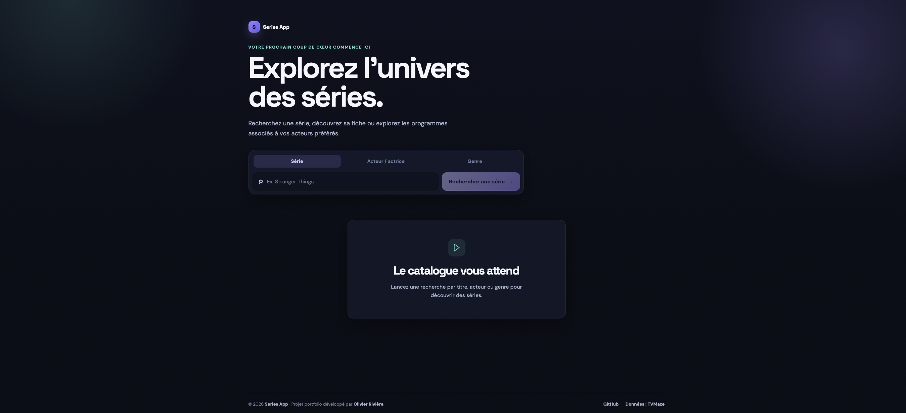
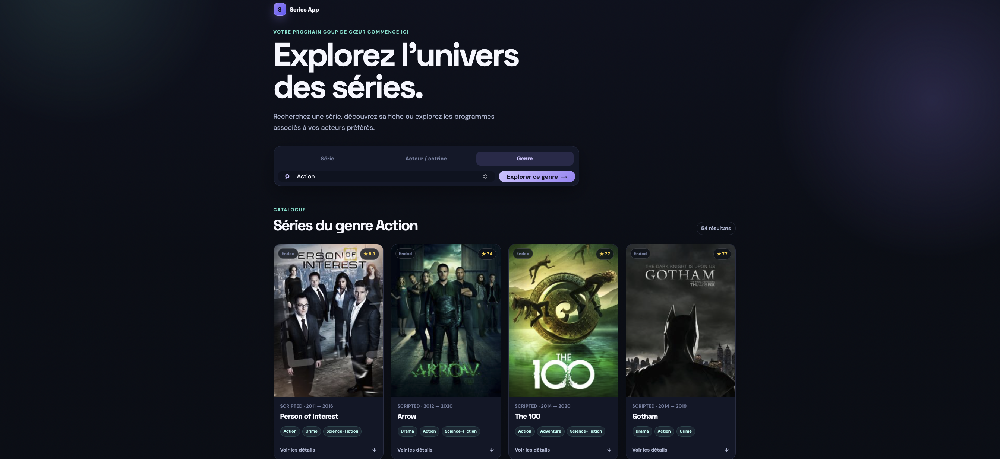
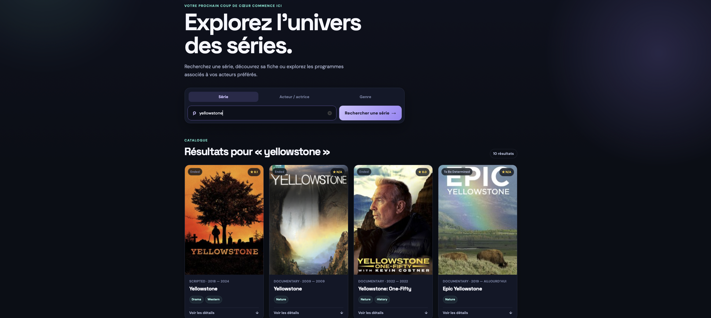

# 🎬 Series App

Application web de recherche de séries TV développée avec React et Vite.  
Elle permet d’explorer un catalogue de séries par titre, acteur ou genre grâce à l’API publique [TVMaze](https://www.tvmaze.com/).

🔗 **Application en ligne :** [series-app-react-rivoli.netlify.app](https://series-app-react-rivoli.netlify.app/)  
👨‍💻 **Portfolio :** [olivier-riviere-web.vercel.app](https://olivier-riviere-web.vercel.app)

## Aperçu





## Fonctionnalités

- Recherche de séries par titre
- Recherche de séries associées à un acteur ou une actrice
- Exploration du catalogue par genre
- Fiches détaillées : synopsis, genres, note, statut, langue, diffuseur et site officiel lorsque disponible
- Pagination des résultats
- États de chargement, d’erreur et d’absence de résultat
- Interface responsive pensée pour ordinateur, tablette et mobile
- Données fournies par l’API TVMaze

## Stack technique

| Technologie | Utilisation |
|---|---|
| [React 19](https://react.dev/) | Construction de l’interface et gestion de l’état |
| [Vite](https://vite.dev/) | Environnement de développement et build de production |
| JavaScript | Logique applicative |
| CSS | Design responsive et composants visuels personnalisés |
| [TVMaze API](https://www.tvmaze.com/api) | Données sur les séries, genres et acteurs |

## Installation locale

### Prérequis

- [Node.js](https://nodejs.org/) 20.19 ou supérieur
- npm

### Lancer le projet

```bash
git clone https://github.com/Olivier-RIVIERE/series-app.git
cd series-app
npm install
npm run dev
```

L’application sera accessible sur l’URL affichée par Vite, généralement :

```text
http://localhost:5173
```

## Commandes disponibles

```bash
npm run dev
```

Lance le serveur de développement avec rechargement à chaud.

```bash
npm run build
```

Génère une version optimisée de production dans le dossier `dist`.

```bash
npm run preview
```

Prévisualise localement le build de production.

## Évolution du projet

Ce projet a été initialement réalisé pendant ma formation de Développeur Web et Web Mobile. Il a ensuite été repris et modernisé afin d’améliorer l’expérience utilisateur, la recherche par acteur, l’accessibilité des interactions, la gestion des états de l’interface et l’outillage technique avec une migration de Create React App vers Vite.

## Auteur

**Olivier Rivière**  
Développeur web junior, en reconversion professionnelle.

- Portfolio : [olivier-riviere-web.vercel.app](https://olivier-riviere-web.vercel.app)
- GitHub : [Olivier-RIVIERE](https://github.com/Olivier-RIVIERE)

## Remerciements

Les données affichées sont fournies par [TVMaze](https://www.tvmaze.com/).  
Ce projet est réalisé à des fins de démonstration et de portfolio.